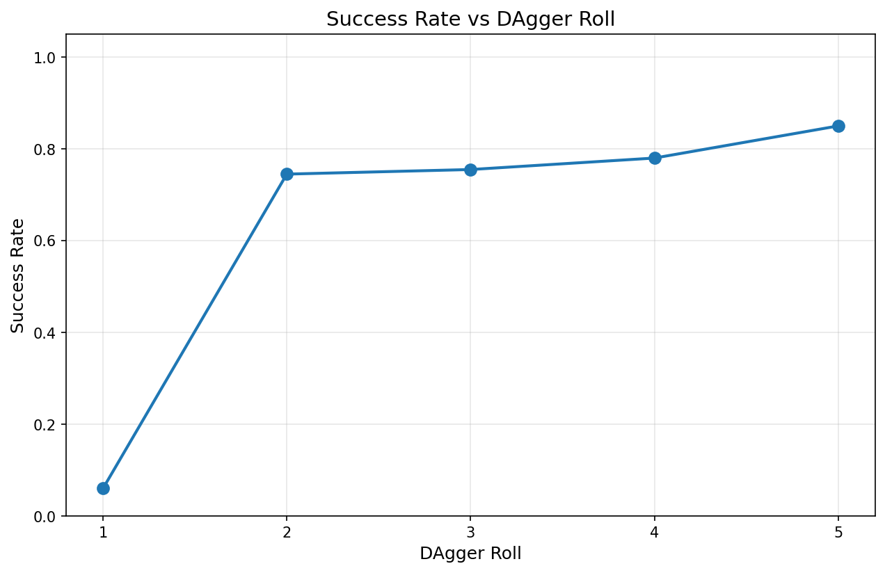
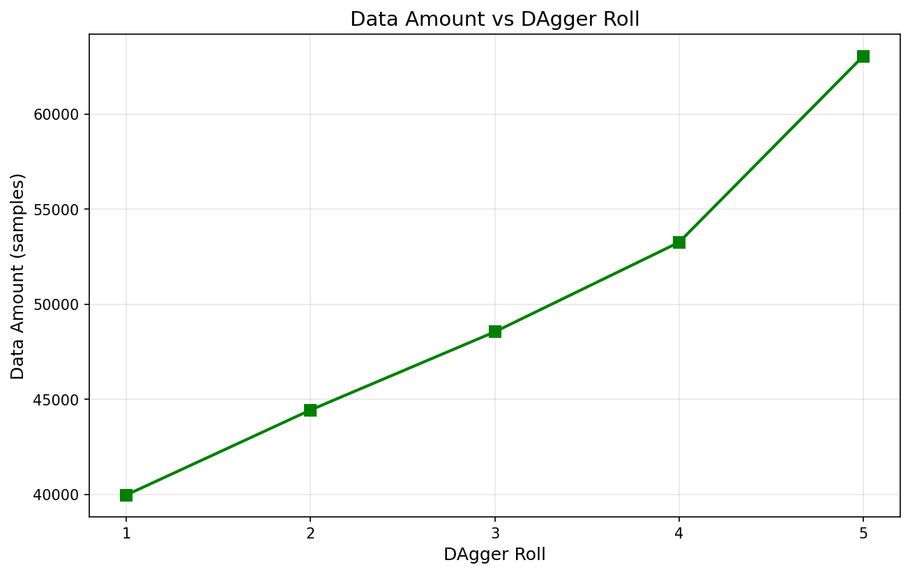

# go1_mimic

The isaaclab env enabling RL/IL of the navigation task of unitree go1 robot.
Modified from the `Isaac-Navigation-Flat-Anymal-C-v0` environment of isaaclab.


## Requirements
This env is developed and tested with:
+ isaacsim 4.5
+ isaaclab, `main` branch, commit `d13cb0b6043db6ae9b2efc3ab1ac64f7a77ed3ed` , date Sun Dec 28 02:27:34 2025 +0100, Fixes backward compatibility to IsaacSim 4.5 for new stage utils (#4230)
+ ubuntu 20.04 LTS

Other versions/OSs are very likely to work as well.

## Run
1. follow [Template_README.md](Template_README.md) to install this env to your isaaclab python env via `pip install`
2. **Reinforcement Learning (flat terrian)**
   1. launch with
   ```bash
    python scripts/rsl_rl/train.py --task ILBL-Go1-Nav-Flat-v0 --enable_cameras
   ```
3. **Imitation Learning**  
   Install `robomimic` following isaaclab's instarucitions first. If you installed all modules on isaaclab installation, robomimic has then been already installed.

   1. collect data with
   ```bash
   python scripts/tools/record_demos.py --task ILBL-Go1-Mimic-Rough-v0 --dataset_file ./dataset/dataset.hdf5 --enable_cameras 
   ```
   use arrow keys and Z, X key to teleoperate with keyboard  

   2. train with 
   ```bash
    python scripts/robomimic/train.py --task ILBL-Go1-Mimic-Rough-v0 --algo bc  --dataset ./dataset/dataset.hdf5
   ```
   3. view trained policy with
   ```bash
    python scripts/robomimic/play.py --enable_cameras --task ILBL-Go1-Mimic-Rough-v0 --num_rollouts 20 --horizon 100 --checkpoint logs/robomimic/ILBL-Go1-Mimic-Rough-v0/bc_rnn_image_go1_nav/XXXXXX/models/XXXXXX.pth
   ```

4. **DAgger (Dataset Aggregation)**

   DAgger is an iterative imitation learning algorithm that improves policy performance by collecting additional training data in regions where the current policy struggles. The process alternates between:
   - Rolling out the current policy
   - Collecting human corrective demonstrations when the policy makes mistakes
   - Merging new data with existing dataset
   - Fine-tuning the policy on the aggregated dataset

   Example results showing success rate and data amount across DAgger iterations:

   
   

   **DAgger workflow:**

   1. Collect human demonstration data with DAgger:
   ```bash
   python scripts/dagger/pure_dagger_collect.py \
       --task ILBL-Go1-Mimic-Rough-v0 \
       --checkpoint logs/robomimic/ILBL-Go1-Mimic-Rough-v0/bc_rnn_go1_nav_latent_lader/XXXXXX/models/model_epoch_XXX.pth \
       --dataset_file datasets/pure_dagger_demos.hdf5 \
       --num_segments 400 \
       --horizon 100 \
       --debounce_steps 2 \
       --min_segment_length 10 \
       --enable_cameras
   ```
   Use arrow keys and Z, X key to provide corrective control. The robot will automatically switch to human mode when you provide non-zero input.

   2. Merge datasets (if collecting multiple sessions):
   ```bash
   python scripts/tools/merge_hdf5_datasets.py \
       --input_files datasets/pure_dagger_demos_0.hdf5 datasets/pure_dagger_demos_1.hdf5 \
       --output_file datasets/pure_dagger_demos_merged.hdf5
   ```

   3. Fine-tune the policy with merged dataset:
   ```bash
   python scripts/dagger/dagger_finetune.py \
       --checkpoint logs/robomimic/ILBL-Go1-Mimic-Rough-v0/bc_rnn_go1_nav_latent_lader/XXXXXX/models/model_epoch_XXX.pth \
       --original_dataset logs/robomimic/ILBL-Go1-Mimic-Rough-v0/bc_rnn_go1_nav_latent_lader/XXXXXX/merged_dataset.hdf5 \
       --new_dataset datasets/pure_dagger_demos.hdf5 \
       --output_dir logs/robomimic/ILBL-Go1-Mimic-Rough-v0/bc_rnn_go1_nav_latent_lader/dagger_finetuned_X \
       --learning_rate 0.000003 \
       --epochs 1000
   ```

   4. Evaluate the fine-tuned policy:
   ```bash
   python scripts/robomimic/play.py \
       --task ILBL-Go1-Mimic-Rough-v0 \
       --num_rollouts 50 \
       --horizon 150 \
       --enable_cameras \
       --checkpoint logs/robomimic/ILBL-Go1-Mimic-Rough-v0/bc_rnn_go1_nav_latent_lader/dagger_finetuned_X/bc_rnn_go1_nav_latent_lader/XXXXXX/models/model_epoch_XXX.pth
   ```

   5. Evaluate across multiple DAgger iterations:
   Create an input file `scripts/dagger/example_input.txt` with checkpoint and dataset paths (separated by `---`), then run:
   ```bash
   python scripts/dagger/dagger_evaluate.py \
       --input_file scripts/dagger/example_input.txt \
       --task ILBL-Go1-Mimic-Rough-v0 \
       --num_rollouts 200 \
       --horizon 100 \
       --output_dir tempoutputs/dagger_eval \
       --enable_cameras \
       --headless
   ```